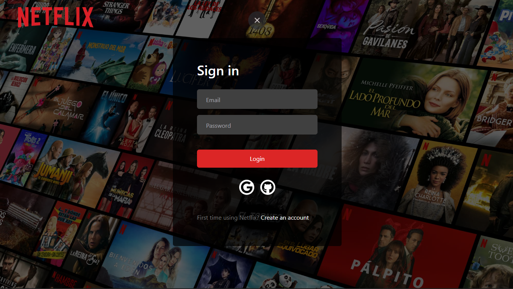
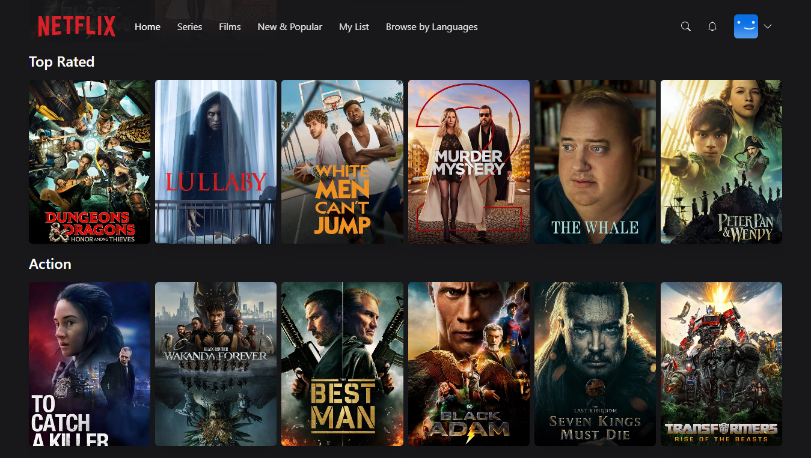
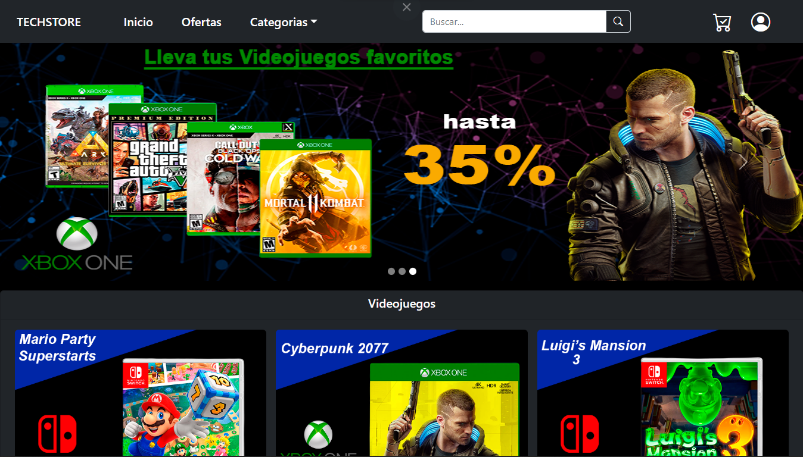
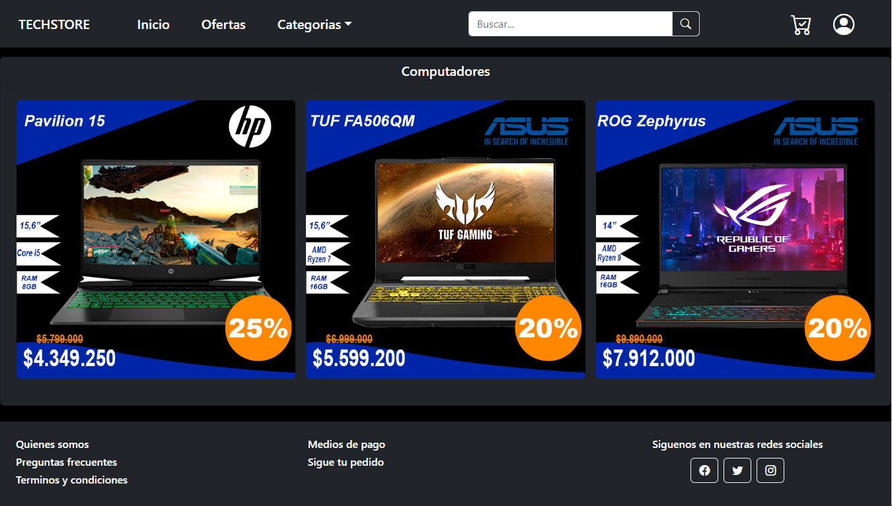
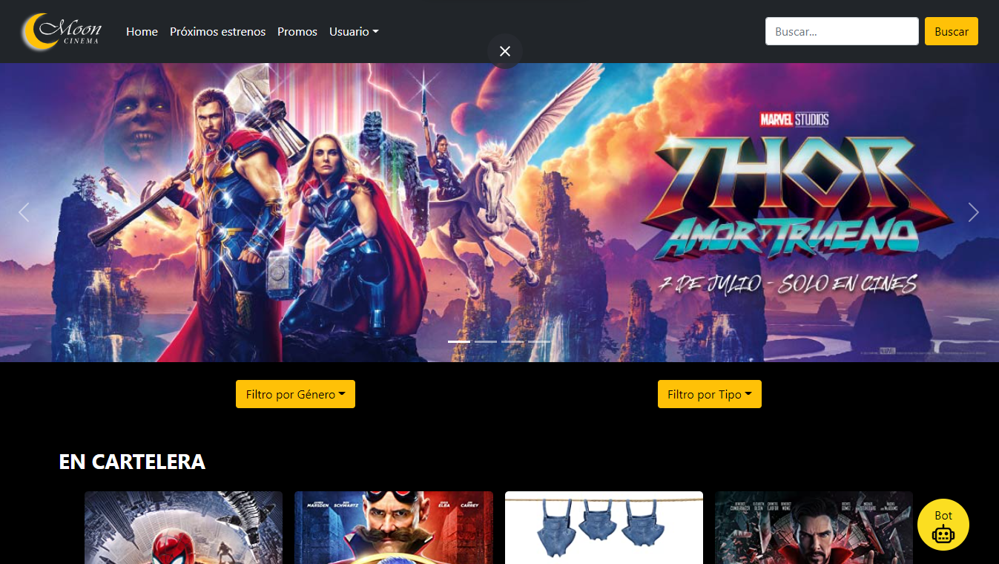
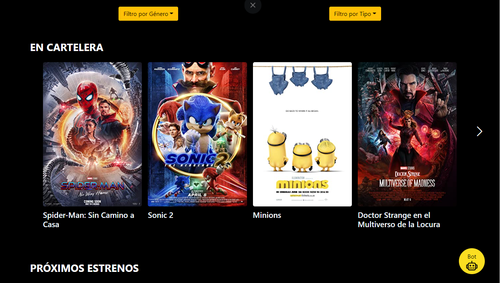

<h1 align="center"> Hi I'm Luis 👋🧑‍💻</h1>

 

    I'm a Full Stack developer, I am currently finishing the SoyHenry bootcamp where I have acquired a lot of technical knowledge and developed personal skills, which have helped me grow in this world of technology.  
    I consider myself a person passionate about constant learning, focused on the search for new challenges where I can put my skills to the test while acquiring new knowledge.  
    As an organized and highly motivated person, I am capable of adapting to any circumstance and always giving my best in any project, while at the same time making an effort to work as a team and promote values such as camaraderie.  
    I have also had the opportunity to work in a team where I was able to familiarize myself with agile methodologies (SCRUM), as well as develop communication skills that facilitate progress towards a common goal in an efficient and harmonious manner.

  

## My Tech skills 🧑‍💻:

<ul>
    <li>HTML</li>
    <li>CSS</li>
    <li>JavaScript</li>
    <li>TypeScript</li>
    <li>React</li>
    <li>Redux</li>
    <li>Next JS</li>
    <li>Tailwind</li>
    <li>Chakra</li>
    <li>Bootstrap</li>
    <li>Nodejs</li>
    <li>Nest JS</li>
    <li>Express</li>
    <li>Prisma.io</li>
    <li>Sequelize</li>
    <li>Mongoose</li>
    <li>MongoDB</li>
    <li>PostgreSQL</li>
    
</ul>

  

# My Projects:

<h2>Netflix Clone 🎦</h2>

<code></code>
<code></code>

&nbsp;&nbsp;

<h2>TechStore 🛒📲💻</h2>

<code></code>
<code></code>

<h2>MoonCinema 🍿🍿</h2>

<code></code>
<code></code>

