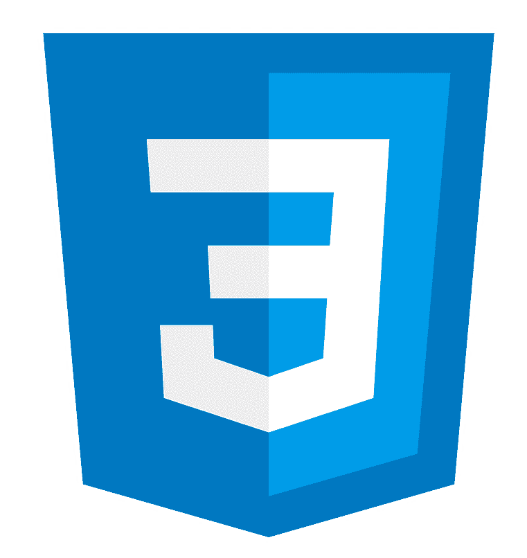

<h1 align="center"> Hi I'm Luis 👋🧑‍💻</h1>

 

- -👨‍💻 I'm a Full Stack developer

- 🛠️ I’m currently working on Rockdidit

- 💡 I’m currently learning **Angular and React Native**

- 🤝 I’m looking for help with **Creation of websites and support of open source projects**

- 💼 All of my projects are available at [https://portfolio-luisdavid.vercel.app](https://portfolio-luisdavid.vercel.app)

- 📫 How to reach me **luisdavid.0698@gmail.com**

  

  

## My Tech skills 🧑‍💻:

  

       
     
  

  

       
     
  

  

       
     
  

  

       
    
  

  

       
    
  

  

       
    
  

  

       
    
  

  

       
    
  

  

       
    
  

  

       
    
  

  

       
    
  

  

       
    
  

  

       
    
  

  

       
    
  

  

       
    
  

  

## Statistics 📊:

 
   

   

   

 

  
